# HTTP-1-网络基础

## 了解 Web 及网络基础 😁 

## **HTTP**（HyperText Transfer Protocol，超文本传输协议 ）

## **HTTP版本：**

* HTTP/0.9
* HTTP/1.0——正式作为标准被公布
* HTTP/1.1——目前主流的 HTTP 协议版本

## **TCP/IP:**把与互联网相关联的协议集合

* 分层管理：
  * **应用层**：向用户提供应用服务时通信的活动，预存了各类通用的应用服务。比如，**FTP**（File Transfer Protocol，文件传输协议）和 **DNS**（Domain Name System，域名系统）服务 、**HTTP 协议**。
  * **传输层**：对上层应用层，提供处于网络连接中的两台计算机之间的数据传输。**TCP**（Transmission Control Protocol，传输控制协议）和 **UDP**（User Data Protocol，用户数据报协议）。
  * **网络层**：**处理**在网络上流动的**数据包**。规定了通过怎样的路径 （所谓的传输路线）到达对方计算机，并把数据包传送给对方。（数据包是网络传输的最小数据单位）
  * **链路层**：处理连接网络的**硬件**部分。包括控制操作系统、硬件的设备驱动、NIC（Network Interface Card，网络 适配器，即网卡），及光纤等物理可见部分（还包括连接器等一切传输媒介）。硬件上的范畴均在链路层的 作用范围之内。

在传输层（TCP 协议）把从应用层处收到的数据（HTTP 请求报文）进行分割，并在 各个报文上打上标记序号及端口号后转发给网络层。 在网络层（IP 协议），**增加作为通信目的地的 MAC 地址**后转发给链路层。这样一来，发往网络的通信请求就准备齐全了。

## IP　TCP　DNS

* **IP**:**网络层,**把各种数据包传送给对方,为确实传递到对方,需满足两重要条件IP地址和MAC地址（Media Access Control Address）。IP 地址指明了**节点被分配到的地址**，MAC 地址是指**网卡所属的固定地址**。IP 地址可以和 MAC 地址进行配对。I**P 地址可变换**，但 **MAC 地址**基本上**不会更改。**
  * **使用 ARP 协议凭借 MAC 地址通信**:多次中转后,会利用下一站中转设备的MAC地址来搜索下一个中转目标.采用ARP来解析地址,用IP地址反查MAC地址．
* **TCP**:**传输层**，提供可靠的**字节流**服务。
  * 三次握手
* **DNS**:提供通过域名查找 IP 地址，或逆向从 IP 地址反查域名 的服务。

## URI和URL

* URI\(Uniform Resource Identifier,统一资源标识符\)

## TCP拥塞控制

拥塞处理包括了四个算法，分别为慢开始，拥塞避免，快速重传，快速恢复。

### 慢开始

拥塞窗口——每过一定数据量窗口大小翻倍——增长有阈值——大于阈值启动拥塞避免。

### 拥塞避免

每过一定数据量窗口大小只加一。

### 快速重传

收到三个重复的ACK，将启动快速重传。具体分两种：

#### TCP Taho

#### TCP Reno

## TLS

TLS协议位于传输层之上，应用层之下。首次进行TLS协议传输需要两个RTT，接下来可通过Session Resumption减少到一个RTT。使用了两种加密技术：对称加密和非对称加密。

### 对称加密：

两边有相同的密钥，两边都知道如何将密文加密解密

### 非对称加密：

有公钥私钥之分，公钥所有人都知道，可以将数据用公钥加密，但是将数据解密必须使用私钥解密，私钥只有分发公钥的一方知道。

