# HTTP6-HTTP首部

## HTTP报文首部

* 报文首部
* 空行
* 报文主体

必定包含HTTP首部，客户端和服务器端分别处理请求和响应提供所需要的信息。

### HTTP请求报文


```javascript
GET / HTTP/1.1
Host: hackr.jp
User-Agent: Mozilla/5.0 (Windows NT 6.1; WOW64; rv:13.0) Gecko/20100101 Firefox/13.0
Accept: text/html,application/xhtml+xml,application/xml;q=0.9,*/*; q=0.8
Accept-Language: ja,en-us;q=0.7,en;q=0.3
Accept-Encoding: gzip, deflate
DNT: 1
Connection: keep-alive
If-Modified-Since: Fri, 31 Aug 2007 02:02:20 GMT
If-None-Match: "45bae1-16a-46d776ac"
Cache-Control: max-age=0
```

### HTTP响应报文



```text
HTTP/1.1 304 Not Modified
Date: Thu, 07 Jun 2012 07:21:36 GMT
Server: Apache
Connection: close
Etag: "45bae1-16a-46d776ac"
```

## HTTP首部字段

### 传递信息

为浏览器和服务器提供报文主体大小,所使用语言,认证信息等内容

### HTTP首部字段结构

```text
首部字段名：字段值
```

```text
Content-Type: text/html
```

### 四种首部字段类型

以在前面图片中说明

### HTTP/1.1首部字段

### 非HTTP/1.1首部字段

Set-cookies和Cookie,Content-Disposition等


