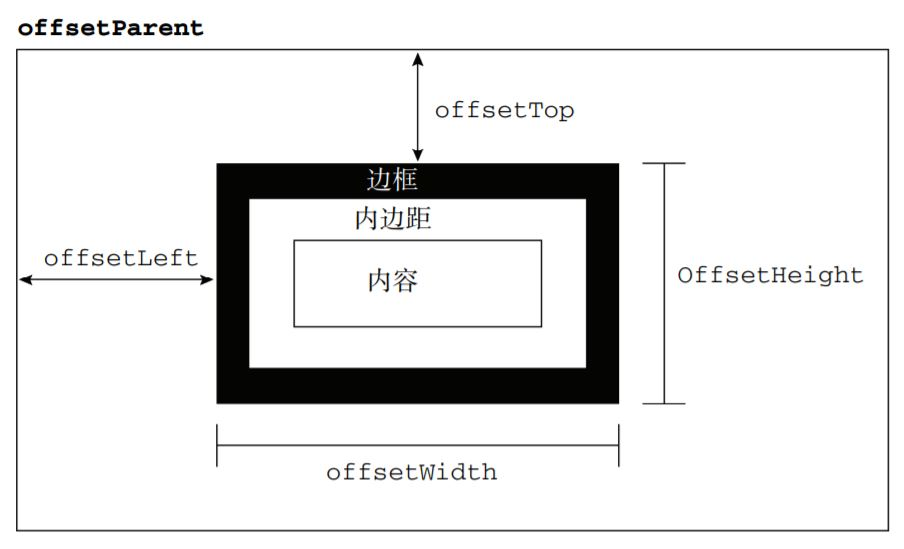
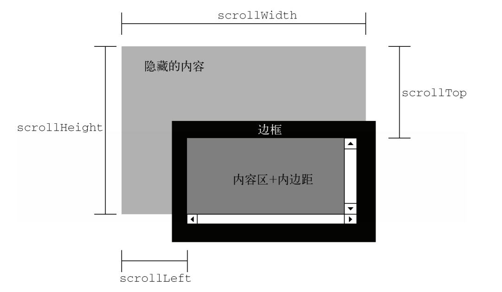
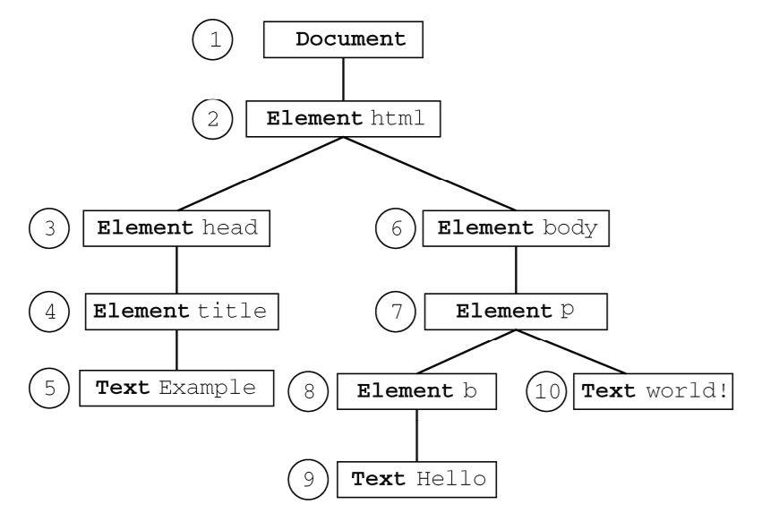

# JS—DOM2-and-DOM3

DOM1级主要定义的是HTML和XML文档的底层结构。DOM2和DOM3级则在这个结构的基础上引入了更多的交互能力。

## 样式

### 访问元素的样式

```javascript
var myDiv = document.getElementById('myDiv');
myDiv.style.backgroundColor = 'red';
```

1. DOM样式属性和方法
   * cssText:能够访问到style特性中的CSS代码
   * removeProperty\(propertyName\):样式中删除属性。
   * getPropertyValue：返回给定属性的字符串值
   * item\(index\)：返回给定位置的CSS属性的名称
2. 计算的样式

   style对象不包含从其他样式表层叠而来的样式信息。DOM2增强了document.defaultView，提供了getComputedStyle\(\)方法。参数为所求元素和一个伪元素字符串（可以为Null）。

   ```markup
   <!DOCTYPE html>
   <html>
   <head>
   <title>Computed Styles Example</title>
   <style type="text/css">
   #myDiv {
   background-color: blue;
   width: 100px;
   height: 200px;
   }
   </style>
   </head>
   <body>
   <div id="myDiv" style="background-color: red; border: 1px solid black"></div>
   </body>
   </html>
   ```

   ```javascript
   var myDiv = document.getElementById("myDiv");
   var computedStyle = document.defaultView.getComputedStyle(myDiv, null);
   alert(computedStyle.backgroundColor); // "red"
   alert(computedStyle.width); // "100px"
   alert(computedStyle.height); // "200px"
   alert(computedStyle.border); // 在某些浏览器中是"1px solid black"
   ```

   IE不支持该方法，但又类似，每个有style属性的元素有一个currentStyle属性。

所有计算的样式都为**只读**的。

### 操作样式

1. CSS规则
2. 创建规则

   ```javascript
   sheet.insertRule("body {background-color:silver}",0);
   ```

3. 删除规则

   ```javascript
   sheet.deleteRule(0);
   ```

### **元素大小**

#### 偏移量

* offsetHeight
* offsetWidth
* offsetLeft
* offsetTop



#### 客户区大小

* clientWidth
* clientHeight


#### 滚动大小

* scrollHeight
* scrollWidth
* scrollLeft
* scrollTop



### **确定元素大小**

`getBoundingClientRect()`方法，返回一个矩形对象，包含4属性：left,top,right和bottom。给出了元素在页面中**相对视口**的位置。

### **遍历**

两个用于辅助完成顺序遍历的DOM结构的类型：NodeIterator和TreeWalker。能够基于给定起点对DOM结构执行深度优先的遍历操作。



#### **NodeIterator**

1. document.createNodeIterator\(\)方法创建实例，四参数root、WhatToShow、filter、（无用参数）

   ```javascript
   var iterator = document.createNodeIterator(document, NodeFilter.SHOW_ALL,null, false);
   ```

2. 类型的主要方法是nextNode\(\)和previousNode\(\)。

#### **TreeWalker**

是NodeIterator的更高级版本。包括nextNode\(\)和previousNode\(\)还有其他方法：

1. parentNode\(\)
2. firstChild\(\)
3. lastChild\(\)
4. nextSibling\(\)
5. previousSibling\(\)

创建TreeWalker对象需使用document.createTreeWalker\(\)方法。

```javascript
var walker= document.createTreeWalker(div, NodeFilter.SHOW_ELEMENT,
filter, false);
```

### 

### 

### 

