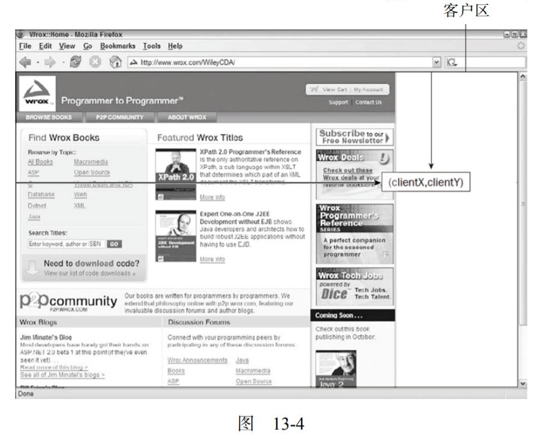
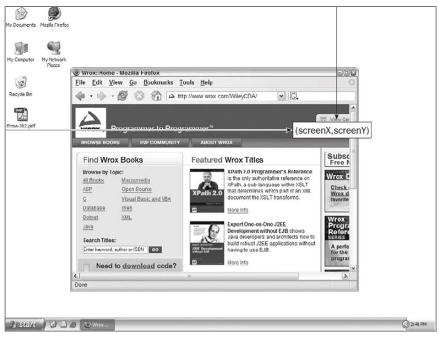

# JS-事件

JavaScript与HTML的交互是通过**事件**实现的。事件就是文档或浏览器窗口中发生的一些特定的交互瞬间。可以使用侦听器来预订事件。

## 事件流

事件流描述的是从页面中接收事件的顺序。IE 的事件流是事件冒泡流，而 Netscape Communicator 的事件流是事 件捕获流。

### 事件冒泡

事件冒泡为IE的事件流。由最具体的元素接收，然后逐级上传。

IE5.5 及更早版本中的事件冒泡会跳过元素（从直接跳到 document）。IE9、Firefox、Chrome 和 Safari 则将事件一直冒泡到 window 对象。

### 事件捕获

不太具体的节点应该更早接收到事件，而最具体的节点应该最后接收到事件。

### DOM事件流

包括三个阶段：事件捕获阶段、处于目标阶段和事件冒泡阶段。

## 事件处理程序

### HTML事件处理程序

* 避免在代码中使用HTML实体

  HTML中指定事件处理程序缺点：

* 存在时差问题，使用try-catch捕获错误：

  ```javascript
  <input type="button" value="Click me" onclick="try{showMessage();}catch(ex){}">
  ```

* 在不同浏览器中会导致不同结果。
* HTML代码和JavaScript代码紧密耦合，难以修改。

### DOM0级事件处理程序

```javascript
var btn = document.getElementById("myBtn");
btn.onclick = function(){
    console.log("clicked");
};
```

在这些代码运行前，不会指定事件处理程序。若代码在按钮的后面，有可能一段时间内，怎么点击都没有反应。

* this指向绑定事件的元素
* 删除事件处理程序：`btn.onclick = null`

### DOM2级事件处理程序

两个方法：

* `addEventListener()`
* `removeEventListener()`

  两个方法都接收三个参数：要处理的事件名、作为事件处理程序的函数和一个布尔值，最后的布尔值若为true，则在捕获阶段调用事件处理程序；若为false，则在冒泡阶段调用事件处理程序。

  ```javascript
  var btn = document.getElementById("myBtn");
  btn.addEventListener("click",function(){
    console.log(this.id);
  },false);
  ```

  使用addEventListener\(\)添加的事件处理程序只能用removeEventListener\(\)来移除。移除时传入的参数需与添加处理程序时使用的参数相同。因此，addEventListener\(\)中若使用匿名参数，则将无法移除事件处理程序。

因此添加事件处理程序时需指定函数名。

### IE事件处理程序

`attachEvent()`和`detachEvent`。接收相同的两个参数：事件处理程序名称与事件处理程序函数。只支持冒泡。

## 事件对象

触发DOM上某个事件时，会产生一个事件对象event,包含着所有与事件有关的信息。

### DOM中的事件对象

```javascript
var btn = document.getElementById('myBtn');
//DOM0
btn.onclick=function(event){
    alert(event.type);
};
//DOM2
btn.addEventListener("click",function(event){
    alert(event.type);
},false);
```

所有事件都有下表列出的成员（列出部分）：

| 属性/方法 | 说明 |
| :--- | :--- |
| currentTarget | 事件处理程序当前处理的元素 |
| defaultPrevented | 为true表示已经调用了preventDefault |
| eventPhase | 调用事件处理程序的阶段（123） |
| preventDefault | 取消事件默认行为 |
| stopPropagation | 取消事件进一步冒泡和捕获 |
| target | 事件目标 |
| stopImmediatePropagation | 取消事件的进一步捕获或冒泡，同时阻止任何事件处理程序被调用 |
| type | 被触发的事件的类型 |

```javascript
document.body.onclick = function(event){
 alert(event.currentTarget === document.body); //true
 alert(this === document.body); //true this和currentTarget指向注册事件处理程序的元素
 alert(event.target === document.getElementById("myBtn")); //true 指向真正的事件触发对象
};
```

### IE中的事件对象

### 跨浏览器的事件对象

## 事件类型

### UI事件

指那些不一定与用户操作有关的事件

* load：页面**完全加载**后触发
* unload：当页面完全卸载后触发
* resize：当窗口或框架的大小变化时在window或框架上面触发
* scroll：当用户滚动带滚动条的内容时触发

### 焦点事件

在页面元素获得或失去焦点时触发

* blur：在元素失去焦点时触发
* focus：在元素获得焦点时触发
* focusin：同上，但冒泡
* focusout：blur的通用版本

### 滚轮和鼠标事件

* click：单击鼠标左键或按回车键时触发
* dbclick：双击触发
* mousedown
* mouseleave
* mousemove
* mouseout
* mouseover
* mouseup

#### 坐标位置

客户区坐标位置

`event.clientX event.clientY`



页面坐标位置

`pageX pageY`

屏幕坐标位置

`screenX  screenY`



#### 修改键

shiftKey、ctrlKey、altKey 和 metaKey。

#### 相关元素

#### 鼠标按钮

#### 更多事件信息

#### 鼠标滚轮事件

mousewheel事件

### 键盘和文本事件

* keydown
* keypress
* keyup
* 键码：keyCode
* 字符编码：charCode
* DOM3级变化：不在包含charCode属性，而包含key和char两个新属性

  按下某个字符键时，key的值就是相应的文本字符（如“k”或“M”）；在按下非字符键时， key 的值是相应键的名（如“Shift”或“Down”）。而 char 属性在按下字符键时的行为与 key 相同，但在按下非字符键时值为 null。

* textInpue；只有在可编辑区域才可触发此事件，包含data属性，值为用户输入的字符

### 复合事件

### 变动事件

### HTML5事件

1. DOMContentLoaded事件

   在形成完整的DOM树之后就会触发

2. readystatechange事件

## 内存和性能

### 事件委托

事件委托为**事件处理程序过多**的解决方案

```javascript
var list = document.getElementById("myLinks");
EventUtil.addHandler(list, "click", function(event){
 event = EventUtil.getEvent(event);
 var target = EventUtil.getTarget(event);
 switch(target.id){
 case "doSomething":
 document.title = "I changed the document's title";
 break;
 case "goSomewhere":
 location.href = "http://www.wrox.com";
 break;
 case "sayHi":
 alert("hi");
 break;
 }
});
```

## 模拟事件

