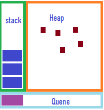

# 趣说Js——事件循环

## “运行时概念”

1. Stack为栈，此客栈房间一个个，函数诃德到来时，将把函数的参数及变量等随身物品丢入客栈中，函数启程返回时，将物品按顺序带走。如带走钱包的同时将把钱带走。
2. Heap为堆，对象在此聚集！
3. Quene为队列，JS运行时排着这么一个队列，队列里每个事件都有相应人员处理

## ”一根筋"模式

消息们不管人数多少，都排成一条队。有个消息排着队打着游戏没有往前走，也没人理他，后面的消息们就一直这么耽误着。

## **词不达意的“零延迟”**

SetTimeout有两个参数，一个为消息，一个为延迟时间。此延迟时间为将执行函数的最小延迟时间。此函数之前若有其他异步函数需等待，则延迟时间会延长。

## 救急的“斜不停让路法”

一根筋模式导致消息堵塞，交通异常拥挤，后方急救车辆将被耽误。前方车辆急中生智，发明了斜不停停让路法，堵塞交通的消息们斜着身子行驶，中间空出了一条路让急救车辆先过。

