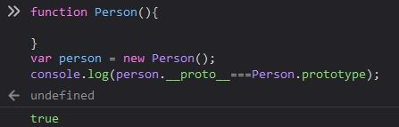

# JS——原型及原型链

## 创建对象

```text
function Person(){

}
var person = new Person();
person.name = 'Lebron';
console.log(person.name);
```

## 打回“原型”——prototype

函数有prototype属性，该属性指向了构造函数创建的实例的原型。

## \_\_proto\_\_

除了null的每个JS对象都有\_\_proto\_\_的属性，指向了对象的原型。



## constructor

原型都有一个constructor属性指向关联的构造函数


## 实例属性的查找

读取实例属性时，若找不到就会去找与对象关联的原型中的属性。再找不到，就在原型的原型上找，直至最顶层。查找至Object.prototype就可停止查找了。


## 原型链


