# ReactBaseClass.js

### Component

```text
function Component(props, context, updater) {
 this.props = props; 
 this.context = context; // 如果组件具有refs，我们将稍后分配其他对象。
 this.refs = emptyObject; 
 // 我们初始化了默认更新程序,但真正的更新需依靠renderer(待明确) 
 this.updater = updater || ReactNoopUpdateQueue; 
}
Component.prototype.isReactComponent = {};
Component.prototype.setState = function(partialState, callback) { 
 invariant( 
   typeof partialState === 'object' 
   || typeof partialState === 'function' 
   || partialState == null,
   );
 this.updater.enqueueSetState(this, partialState, callback, 'setState'); 
};
```

* Component是React组件,是React最重要的部分.
* Component带有props,context,refs及updater四个属性。
* SetState接收partialState及callback，前者为部分state，即传入的state并不需要完整。有两种方式传入，第一为直接传如state对象，第二为传入返回state对象的函数。

### forceUpdate

```text
Component.prototype.forceUpdate = function(callback) {
  this.updater.enqueueForceUpdate(this, callback, 'forceUpdate');
};
```

* forceUpdate为强制执行
* 将跳过shouldComponentUpdate直接渲染。但仍会调用componentWillUpdate和componentDidUpdate。
* 子组件会触发正常的生命周期方法，包括 shouldComponentUpdate\(\) 方法。
* 深层数据结构发生变化时可调用

方法内引用了ReactNoopUpdateQueue对象的enqueueForceUpdate。

### ReactNoopUpdateQueue

`IsMounted`:判断是否已挂载

`enqueueForceUpdate`:强制渲染

```text
enqueueForceUpdate: function(publicInstance, callback, callerName) {
    warnNoop(publicInstance, 'forceUpdate');
  },
```

`enqueueReplaceState`:this.setState调用后state可能不会立即更新。

```text
enqueueReplaceState: function( publicInstance, completeState, callback, callerName, ) { warnNoop(publicInstance, 'replaceState'); },
```

* completeState 为下一状态（Next state）

`enqueueSetState`设置state的子集

```text
enqueueSetState: function(
    publicInstance,
    partialState,
    callback,
    callerName,
  ) {
    warnNoop(publicInstance, 'setState');
  },
```

### PureComponent

* 属性与Component相同
* isPureReactComponent判断方法

```text
function PureComponent(props, context, updater) {
  this.props = props;
  this.context = context;
  // If a component has string refs, we will assign a different object later.
  this.refs = emptyObject;
  this.updater = updater || ReactNoopUpdateQueue;
}

const pureComponentPrototype = (PureComponent.prototype = new ComponentDummy());
pureComponentPrototype.constructor = PureComponent;
// Avoid an extra prototype jump for these methods.
Object.assign(pureComponentPrototype, Component.prototype);
pureComponentPrototype.isPureReactComponent = true;
```

* 仅做对象的浅层比较
* 自带shouldComponentUpdate来优化更新机制
* 若赋予React组件相同的props和state，render函数会渲染相同内容。——此时使用PureComponent更方便
* ComponentDummy继承了Component的原型，为减少内存损耗，没有直接实例化Component实例来让pureComponent继承，而通过ComponentDummy的桥梁来继承。
* 用Object.assign\(\)浅拷贝的方式将Component原型上的方法拷贝至pureComponent中，避免了原型链查找




